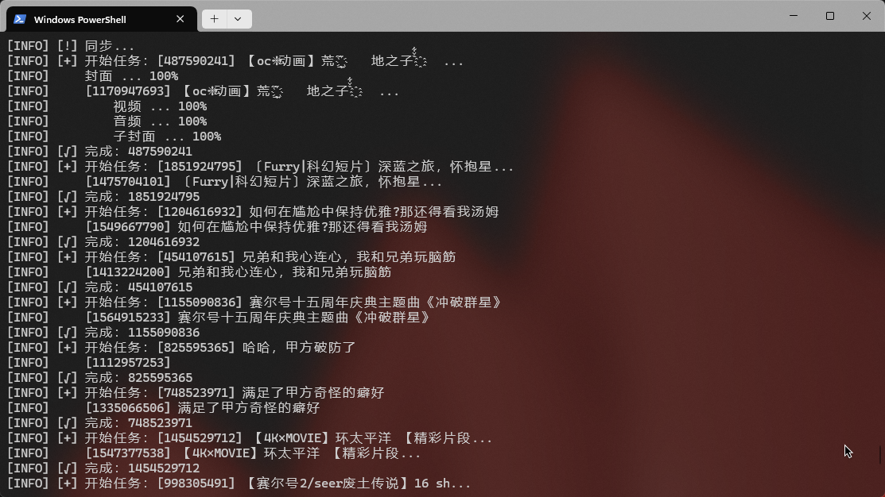

一个自动同步你的b站收藏夹到本地以防失效的程序

它可以：
- 同步你的 b 站收藏夹视频、封面和字幕至本地
- 自动控制调用 api 的频率
- 自定义推送视频失效通知
- 随时暂停/计划暂停同步
- 通过黑白名单进行筛选

以下内容将简称该项目为 BFS (Bilibili Favorite Syncer)

# 可用命令
你可以在同步或清理时间之外使用以下命令

- `help`：查看帮助信息
- `library list`：查看所有收藏夹
- `library {blacklist | whitelist} {enable | disable}`：启用/禁用黑/白名单
- `library {blacklist | whitelist} detail`：查看黑/白名单详情
- `library {blacklist | whitelist} add <id>`：向黑/白名单添加收藏夹
- `library {blacklist | whitelist} remove <id>`：从黑/白名单移除收藏夹
- `library clean`：手动运行一次清理
- `library rec clean [-c]`：清空回收站
- `library rec detail`：查看回收站详情
- `library rec del <name>`：删除特定文件/文件夹，你可以使用引号来处理名字中的空格，如：`library rec del "新建 文本文档.txt"`
- `library export {-f <id> | -v <id> | -v <id> -p <ep>}`：导出视频或收藏夹中的所有视频
- `start [-c | -r]`：开始同步
- `pause {-d <day> | -h <hour> | -m <minute> | -s <second>} [...]`：暂停同步至指定时间后继续
  例如：`pause -d 1 -h 1 -m 10` 暂停同步至 1 天 1 小时 10 分钟后继续

# 关于库
- \<ROOT\>：你不应该改动或直接打开里面的文件/文件夹，你应该使用 `library export` 命令来导出你需要的内容，详见上面的使用说明
  - favorites：已同步的收藏夹
    - \<id\>.json：清单文件
  - recycle：回收站
    - \<aid\>：视频
      - \<cid\>：视频 ep(s)
  - temp：临时文件，不建议在同步时删除，同步后会自动清理，手动清理请使用 `library clean`
    - \<cid\>：正在下载的视频 ep(s)
    - `last_sync.json`：最后一次同步的一些信息
  - videos：已同步的视频
    - \<id\>：收藏夹
      - \<aid\>：视频
        - \<cid\>：视频 ep(s)
          - video：视频
          - audio：音频
          - cover：封面
          - danmaku：弹幕
  - index.json：库清单文件，请勿删除，不建议直接修改，你可以使用相关命令修改

# 一些事情
- 0.1 版本将 UI 框架去掉了，原因是 bug 太多了，在有更好的解决方案之前，更换为新的方案
- 0.1 之前的版本基本上是用不了的
- 不要使用 0.1 之前的版本，因为配置文件有更新

- 两个视频间的处理间隔为 10s
- ~~两 ep 之间的处理间隔为 要同步的内容的数量 * 2s~~
- 下载失败后的重试间隔为 10s
- 两次登录检查的间隔为 3s
- 两次同步的间隔为 30min
- 下载外的网络请求失败默认重试 10 次，间隔为 10s

- 你可以在运行或同步时直接修改库配置文件，它们将在下次同步时生效
- 你可以在同步时关闭程序来暂停同步，然后你就可以使用命令或直接修改配置文件
- 请勿在运行时改变库的文件夹结构，这可能会导致崩溃
- 注意视频失效后不要取消收藏，否则本地的视频会被自动清理，你可以把它移走。未来也许会增加将失效的视频移走的功能。

# TODO
- [ ] 弹幕
- [ ] 看本地已存在视频不够方便
- [ ] 将失效视频移至指定收藏夹
